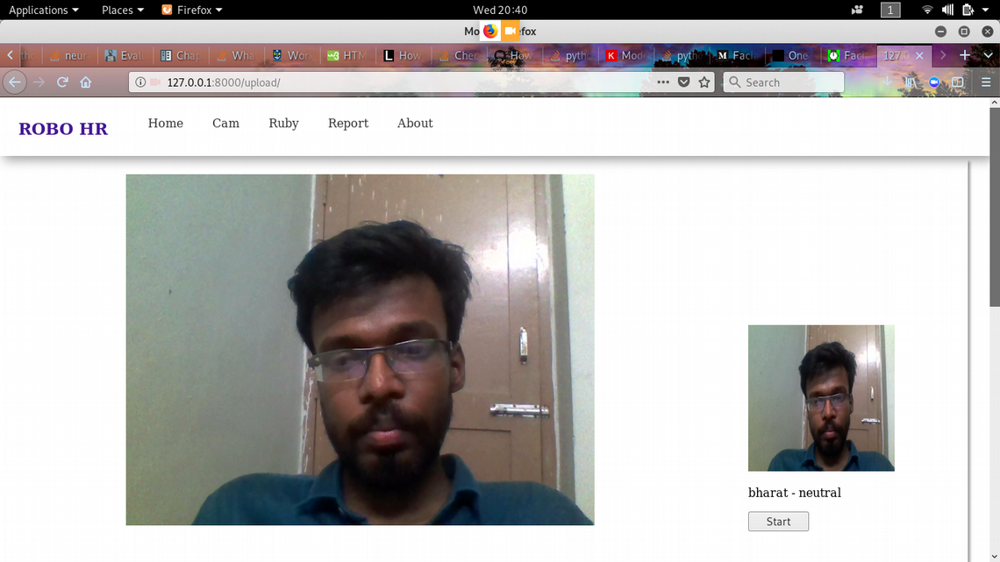

# RoboHR

A face detection and emotion detection system used to perform actvity analysis on employees and students.

### Face Regoniztion
Face regoniztion is done using siamese neural network.

### Emotion Detection
It is done using a CNN(Inception V3). It is retrained using transfer learning

#### Note
The model present in the RoboHR folder is the final model the repo will be refined latter.

This is the example of how face regoniztion and emotion detection at work.
